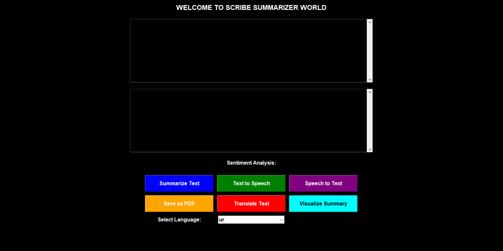
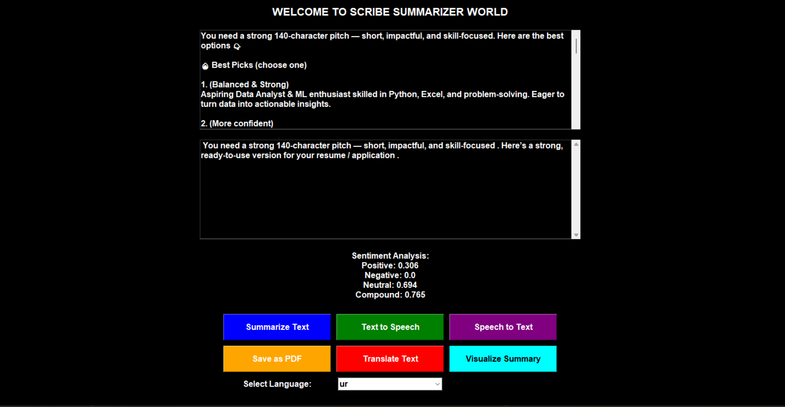
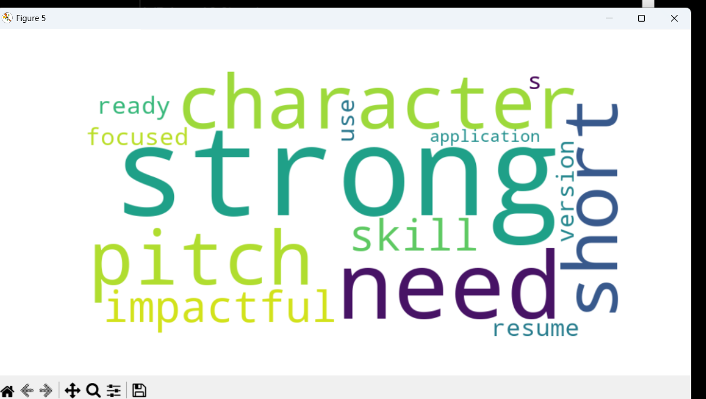
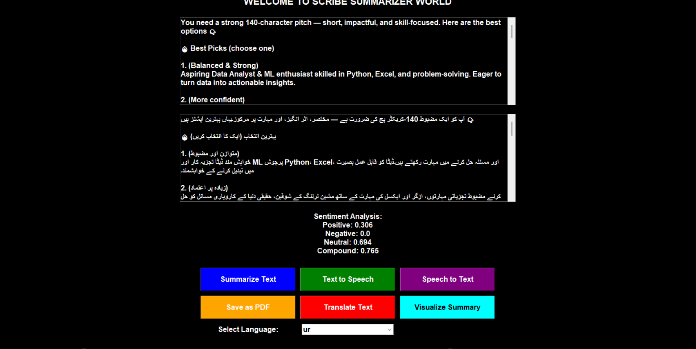
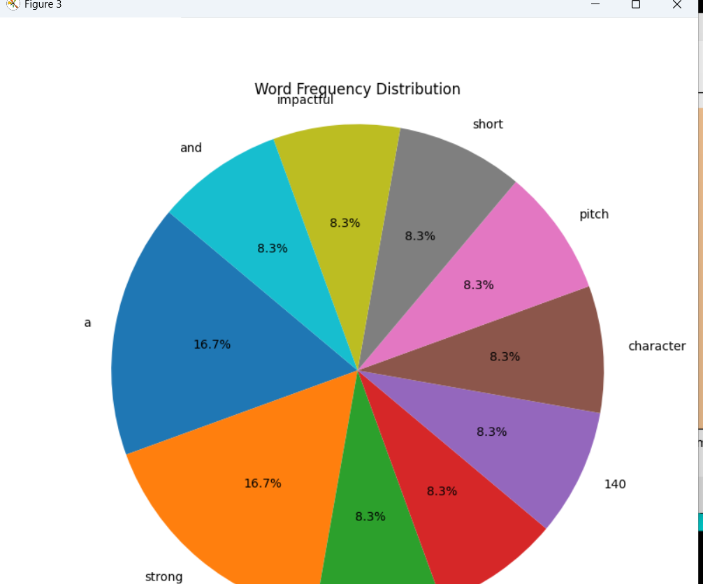
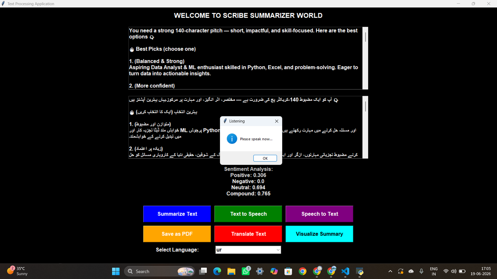

# AI Text Summarization with Speech Integration

AI-powered desktop application that combines Text Summarization, Speech-to-Text, Text-to-Speech, Translation, Sentiment Analysis, PDF Export, and Data Visualization into a single intelligent NLP system.

---

## Overview

This project helps users process large amounts of text efficiently by generating summaries, converting speech to text, converting text to speech, analyzing sentiment, translating content into multiple languages, exporting reports as PDF, and visualizing results through charts and word clouds.

---

## Features

- Text Summarization using NLP
- Speech-to-Text Conversion
- Text-to-Speech Conversion
- Multi-Language Translation
- Sentiment Analysis
- PDF Report Generation
- Word Frequency Visualization
- Word Cloud Generation
- Interactive GUI using Tkinter

---

## Tech Stack

- Python
- Tkinter
- Hugging Face Transformers
- NLTK
- SpeechRecognition
- gTTS
- Google Translate
- Matplotlib
- WordCloud
- ReportLab

---

## Project Screenshots

### Main Interface



### Text Summarization



### Sentiment Analysis


### NLP Processing



### Multi Language Translation



### Data Visualization



### Voice To Text Integration



---

## Functional Modules

### Text Summarization
Generates concise summaries from long text documents using transformer-based NLP models.

### Speech-to-Text
Converts spoken audio into textual content using speech recognition.

### Text-to-Speech
Converts summarized text into audio output.

### Translation
Supports multilingual translation for processed content.

### Sentiment Analysis
Analyzes text and provides Positive, Negative, Neutral, and Compound sentiment scores.

### Visualization
Generates word frequency charts and word cloud visualizations for better understanding of text patterns.

### PDF Export
Allows users to save processed content as PDF reports.

---

## Installation

Clone the repository:

```bash
git clone https://github.com/Syed-SS/text-summarization-speech-integration.git
```

Move into project directory:

```bash
cd text-summarization-speech-integration
```

Install dependencies:

```bash
pip install -r requirements.txt
```

Run the application:

```bash
python main.py
```

---

## Future Enhancements

- Real-Time Voice Assistant
- Advanced NLP Models
- Cloud Deployment
- Document Upload Support
- AI Chat Integration

---

## Author

**Syed Shahed**

AI Engineer | Data Analyst | Machine Learning Enthusiast

LinkedIn:
https://linkedin.com/in/syedshahed-ai

GitHub:
https://github.com/Syed-SS
